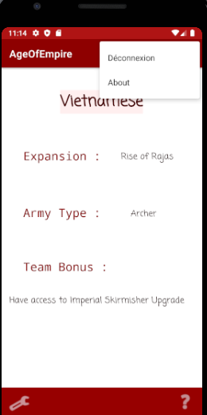
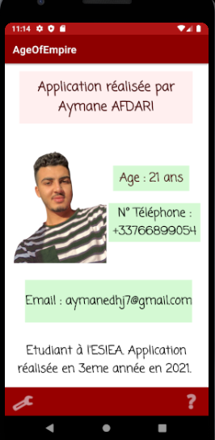

# 🧞‍♂️ AgeOfEmpire – Your magic Android App

AgaOfEmpire est une application Android développée en Kotlin. Une application qui affiche les noms des civilisations des empires, ainsi que leurs caratéristiques.

L'utilisateur pourra distinguer l'application sur son écran AgeOfEmpire grace à son icone sur son écran. 
Ensuite il pourra s'inscrire ou se connecter afin de découvrir les différents noms de civilisations des empires, ainsi que leurs détails. Puis, il pourra se déconnecter par la suite. Ensuite les différentes informations du créateur de l'application sont mises sur une activité About.  

Application développée durant mon cursus scolaire à l'ESIEA en 3eme année en 2021.

<h4> Détails sur l'application : </h4>

- Liste avec une RecyclerView. 

- Détails de chaque élément de la liste

- Données stockées en cache via le cache HTTP.

- Architecture MVVM.

- Interacation avec une base de données Firebase.

- Inscription et connexion des Utilisateurs.

- Déconnexion des utilisateurs.

- Stockage des données dans Firebase.

- Design compatible avec le thème des Empires.

  <h2> Activity : Connexion & Inscription </h2>
 <a href="assets/login.png"><a>
 <a href="assets/Register.png"> <a>

   
  
  <h2> Activity : Afficher les  la liste </h2>
 <a href="assets/list.png"><a>

   
     
  <h2> Activity : Afficher les détails des éléments de la liste </h2>
 <a href="assets/detail1.png"><a>
   <a href="assets/detail2.png"><a>
     
     
     
      <h2> Activity : Afficher les éléments Déconnexion & About </h2>
 <a href="assets/deconnexion.png"><a>
  
   
   
       <h2> Activity : Afficher le contenu de About </h2>
 <a href="assets/about.png"><a>
    

