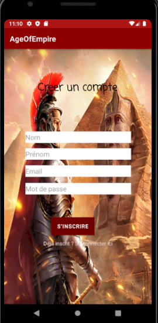
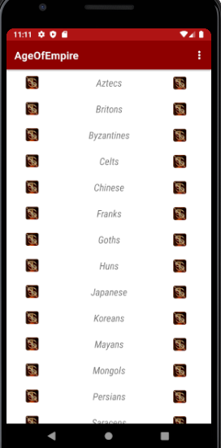
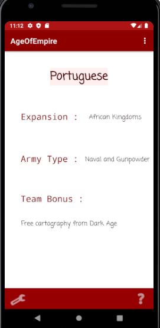
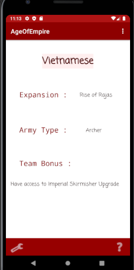

# 🧞‍♂️ AgeOfEmpire – Your magic Android App

AgaOfEmpire est une application Android développée en Kotlin. Une application qui affiche les nomc des civilisations des empires, ainsi que leurs caratéristiques.
Because examples are worth thousand of words: [https://luruke.github.io/aladino/](https://luruke.github.io/aladino/)

Application développé durant mon cursus scolaire à l'ESIEA en 3eme année en 2021.

  <h2> Activity : Connexion & Inscription </h2>
 <a href="assets/login.png"><a>
 <a href="assets/Register.png"> <a>

   
   

  <h2> Activity : Afficher les  la liste </h2>
 <a href="assets/list.png"><a>

   
     

  <h2> Activity : Afficher les détails des éléments de la liste </h2>
 <a href="assets/detail1.png"><a>
   <a href="assets/detail2.png"><a>

